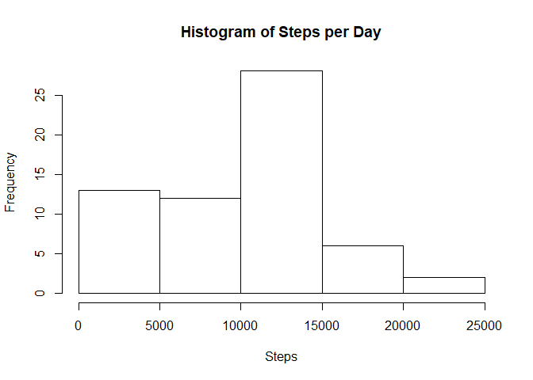
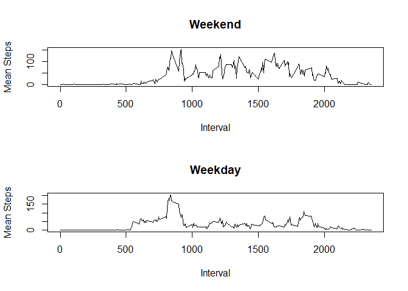

## Loading and preprocessing the data


Preparatory Steps

1. Download the data
1. Load the data into memory


```r
if (!dir.exists("data")) {
    dir.create("data")
}

targetPath = file.path(targetDir, targetFilename)

if (!file.exists(targetPath)) {
    download.file("https://d396qusza40orc.cloudfront.net/repdata%2Fdata%2Factivity.zip", targetPath)
    unzip(targetPath, exdir = targetDir, overwrite = TRUE)
}
```


```r
stepPath = file.path(targetDir, dataFilename)

stepDF = read.csv(stepPath, header = TRUE, na.strings = "NA", colClasses = c("numeric", "character", "numeric"))

stepDF$TimeString = sprintf("%02d%02d", floor(stepDF$interval / 100), stepDF$interval %% 100)
stepDF$StepDate = as.POSIXlt(paste(stepDF$date, stepDF$TimeString, sep = " "), format = "%Y-%m-%d %H%M")
```


## What is mean total number of steps taken per day?


```r
stepsByDate = tapply(stepDF$steps, stepDF$date, sum, na.rm = TRUE)
hist(stepsByDate, xlab = "Steps", main = "Histogram of Steps per Day")
```

<!-- -->

```r
meanStepsPerDay = mean(stepsByDate, na.rm = TRUE)
medianStepsPerDay = median(stepsByDate, na.rm = TRUE)
```

The mean steps per day is 9354.2295082 and the median steps per day is 1.0395\times 10^{4} (NA removed).

## What is the average daily activity pattern?


```r
stepsByInterval = tapply(stepDF$steps, stepDF$TimeString, mean, na.rm = TRUE)

plot(names(stepsByInterval), stepsByInterval, xlab = "Interval", ylab = "Mean Steps", main = "Mean Steps by Interval", type = "l")
```

<!-- -->

```r
maxInterval = names(stepsByInterval[stepsByInterval == max(stepsByInterval)])
```

The interval with the maximum average daily steps is 0835.

## Imputing missing values


```r
missingSteps = stepDF[is.na(stepDF$steps),]
countNA = nrow(missingSteps)

imputedDF = stepDF

for (rowNum in 1:nrow(imputedDF)) {
    if (is.na(imputedDF[rowNum, 1])) {
        imputedDF[rowNum, 1] = median(stepDF[stepDF$TimeString == stepDF[rowNum, 4], 1], na.rm = TRUE)
    }
}

imputedStepsByDate = tapply(imputedDF$steps, imputedDF$date, sum, na.rm = TRUE)
hist(imputedStepsByDate, xlab = "Steps", main = "Histogram of Steps per Day")
```

<!-- -->

```r
imputedMeanStepsPerDay = mean(imputedStepsByDate)
imputedMedianStepsPerDay = median(imputedStepsByDate)
```

There are 2304 rows with missing step counts.

The original mean steps per day is 9354.2295082 and the imputed mean is 9503.8688525.
The original median steps per day is 1.0395\times 10^{4} and the imputed median is 1.0395\times 10^{4}.

## Are there differences in activity patterns between weekdays and weekends?


```r
imputedDF$IsWeekend = factor(ifelse(imputedDF$StepDate$wday %in% c(0, 6), 'weekend', 'weekday'))

weekendDF = subset(imputedDF, imputedDF$IsWeekend == 'weekend')
weekendSBI = tapply(weekendDF$steps, weekendDF$TimeString, mean)

weekdayDF = subset(imputedDF, imputedDF$IsWeekend == 'weekday')
weekdaySBI = tapply(weekdayDF$steps, weekdayDF$TimeString, mean)

par(mfrow=c(2, 1))
plot(names(weekendSBI), weekendSBI, xlab = "Interval", ylab = "Mean Steps", main = "Weekend", type = "l")
plot(names(weekdaySBI), weekdaySBI, xlab = "Interval", ylab = "Mean Steps", main = "Weekday", type = "l")
```

<!-- -->
